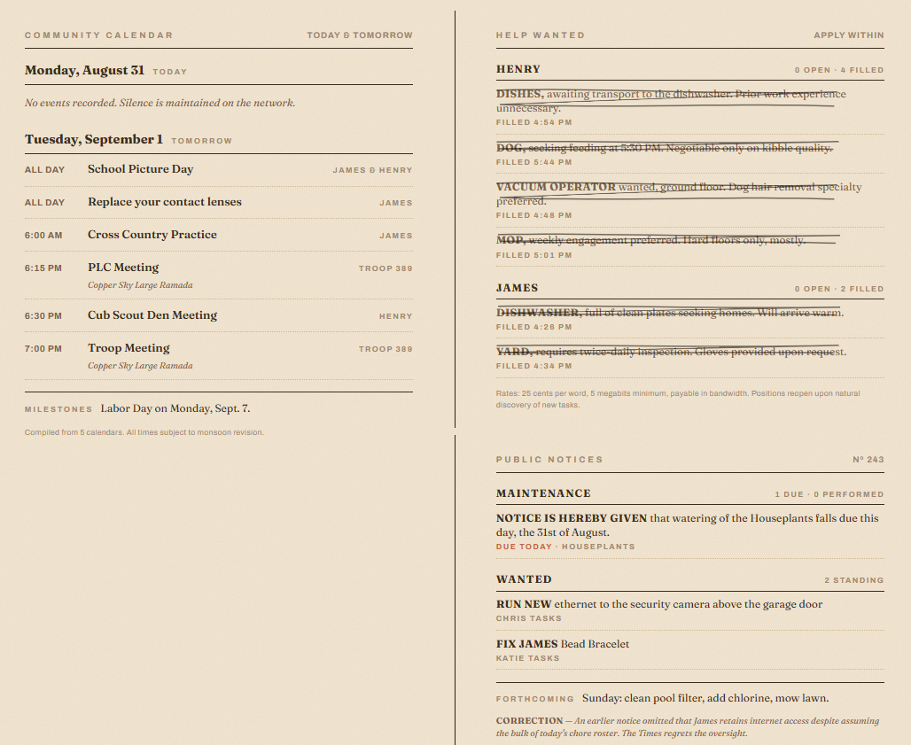

# Homestead Classifieds Card

Three newsprint cards for Home Assistant — a companion to the [Almanac Weather Card](https://github.com/LoneWolf345/desert-almanac-card) and the [Network Ledger Card](https://github.com/LoneWolf345/network-ledger-card). One card, three `mode`s:

- **`calendar`** — Community Calendar: today and tomorrow's events from any number of calendar entities, deduplicated across people ("James & Henry"), venue lines, a `NOW` tag on the event in progress, past events faded, and a MILESTONES footer for the next birthday or anniversary (age computed from a 4-digit year in the event description).
- **`help_wanted`** — the kids' chores as classified ads, grouped by whose turn it is. Open chores read "OPEN · Applications close 8:00 AM"; chores logged today are pencilled out with the time they were filled.
- **`notices`** — Maintenance Supporter tasks as legal notices ("Notice is hereby given that watering of the Houseplants falls due this day…"), open to-dos under WANTED, a FORTHCOMING line for the week, and a CORRECTION box.

- **`masthead`** / **`colophon`** — a newspaper nameplate (title, dateline with Vol. = last digit of the year and No. = day of the year, place, price, a tagline from any sensor) and a footer line. They render synchronously from `hass` — unlike a template markdown card they never paint late, so the page doesn't jump on phones — and the title scales with the column width.

Read-only by design: tap any line for its more-info dialog. Nothing on the page completes anything.

All modes remember their rendered height per device and reserve it on the next load until their data is back (WebKit has no scroll anchoring, so a page scrolled during load would otherwise jump when late content fills in).



## Copy: hand-written, or fresh every day

Every line the cards print has a built-in fallback. Optionally point `copy_entity` at a sensor whose attributes carry fresh copy — see [`docs/homestead-classifieds-sensor.yaml`](docs/homestead-classifieds-sensor.yaml), a trigger-based template sensor that asks an `ai_task` entity once a day and keeps a no-repeat history. Attribute keys: `ad_<chore key>`, `calendar_empty`, `calendar_footer`, `help_wanted_empty`, `help_wanted_footer`, `notices_empty`, `wanted_empty`, `notices_footer`, `correction`. Missing sensor or blank key → the built-in line.

## Installation (HACS)

1. HACS → Custom repositories → add this repo, category **Dashboard**
2. Install **Homestead Classifieds Card**
3. Add cards:

```yaml
type: custom:homestead-classifieds-card
mode: calendar
calendars:
  - { entity: calendar.james, name: James }
  - { entity: calendar.henry, name: Henry }
  - { entity: calendar.troop_389, name: Troop 389 }
milestones_entity: calendar.celebrations
```

```yaml
type: custom:homestead-classifieds-card
mode: help_wanted
# chores default to the seven below; override with your own keys, lead-ins and ad copy
# chores:
#   - { key: dish_load, name: Load dishes, lead: "Dishes,", ad: "dirty, seeking transport to the dishwasher." }
due_entity: sensor.chores_due     # attribute due_list = [chore keys due now]
close_time: "8:00 AM"
```

```yaml
type: custom:homestead-classifieds-card
mode: notices
todo_lists: [todo.chris_tasks, todo.katie_tasks]
forthcoming_days: 7
```

## Options

| Key | Modes | Default | Notes |
|---|---|---|---|
| `mode` | — | required | `calendar` · `help_wanted` · `notices` |
| `title`, `subtitle` | all | per mode | Kicker text, left and right |
| `footer` | all | copy / fallback | Override the footer line |
| `copy_entity` | all | `sensor.homestead_classifieds` | `''` to use built-in copy only |
| `column_rule` | all | `false` | Draw the newspaper column rule in the left gutter (`--almanac-column-rule`, `--almanac-gutter`) |
| `calendars` | calendar | required | `[{entity, name}]` |
| `days` | calendar | `2` | Days to list, starting today |
| `milestones_entity`, `milestone_days` | calendar | `''`, `14` | Calendar for the MILESTONES footer |
| `show_location` | calendar | `true` | |
| `chores` | help_wanted | 7 house chores | `[{key, name, lead, ad, turn_entity, last_entity}]`; defaults `input_select.chore_<key>_turn`, `input_text.chore_<key>_last` (`Name\|YYYY-MM-DDTHH:MM`) |
| `due_entity` | help_wanted | `sensor.chores_due` | Attribute `due_list` |
| `close_time` | help_wanted | `8:00 AM` | Printed on open ads |
| `maintenance` | notices | `true` | Auto-discover Maintenance Supporter task sensors |
| `todo_lists` | notices | `[]` | `todo.*` entities for WANTED |
| `flags_prefix` | notices | `input_boolean.maint_` | Booleans that are on print as standing orders |
| `forthcoming_days` | notices | `7` | |
| `correction` | notices | `true` | Print the `correction` attribute when present |
| `title`, `place`, `price` | masthead | `The Homestead Times`, `''`, `''` | Nameplate text; place/price join the dateline |
| `tagline_entity`, `tagline_fallback` | masthead | `''` | Sensor whose state is the tagline; fallback text when unavailable |
| `lead`, `text` | colophon | `''` | Bold lead-in and the small-caps footer line |

## Theming

Honors `--almanac-paper` (card background; set `transparent` for a one-sheet newspaper look), `--almanac-column-rule`, `--almanac-gutter`, and the standard `--ha-card-border-radius` / `--ha-card-box-shadow`.
